# UPS Modules

## Description
The Axon Ivy [UPS connector](https://developer.ups.com/catalog) enables users to integrate UPS services seamlessly into any business process. This connector:
- Empowers you with full access to the OpenAPI UPS API Catalog
- Features everyday use cases such as tracking packages, obtain shipping rates, and validating addresses
- Provides an easy-to-copy demo implementation to streamline your integration efforts.

Explore the [API catalog](https://developer.ups.com/catalog) to identify which APIs align with your business needs.

## Setup
1. Go to https://developer.ups.com, login with your user or create a new UPS account.
2. Create an application on UPS
3. Once your application is created, the **Client ID** and **Client Secret** are generated and can be used to obtain an access token for authorizing your API requests
4. Configure the following variables in your project:
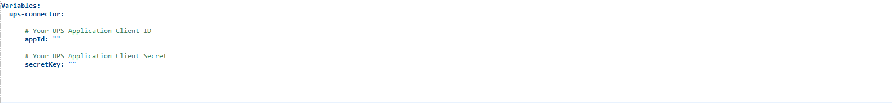

## Demo
### Get tracking information
This service is used to retrieve package information.
1. Login to the Axon Ivy Portal
2. On the Process List page, click on **Get Tracking**

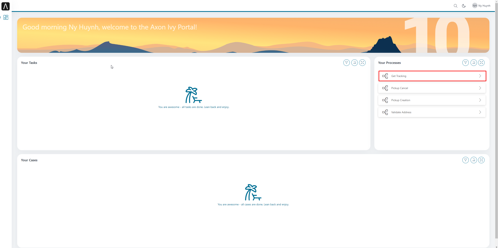

3. Fill in your tracking number

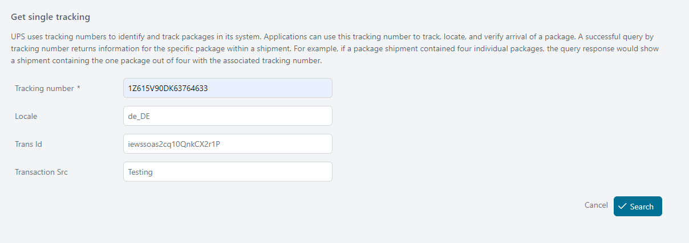

4. Click **Search** button to get all information of the package

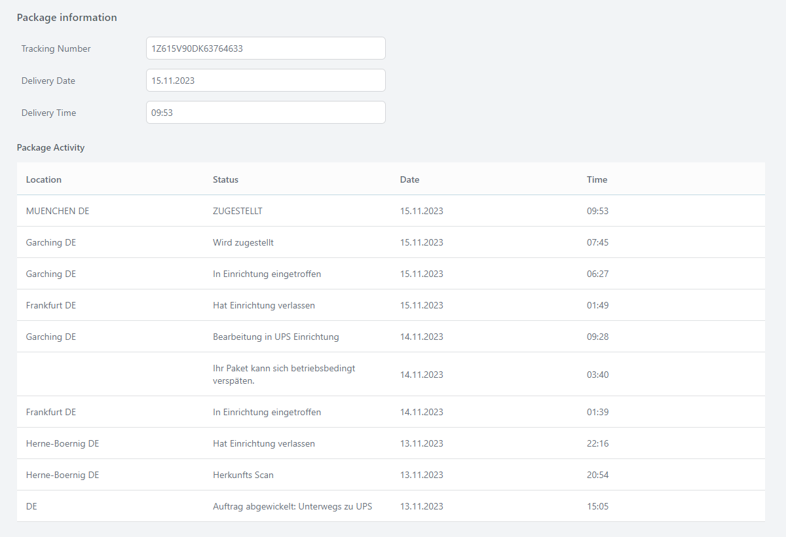

### Pickup Creation
This service is used to schedule pickups.
1. Login to the Axon Ivy Portal
2. On the Process List page, click on **Pickup Creation**

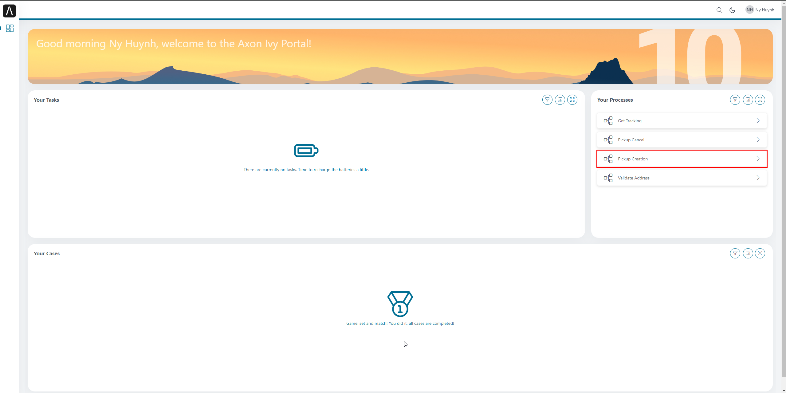

3. Fill in required fields

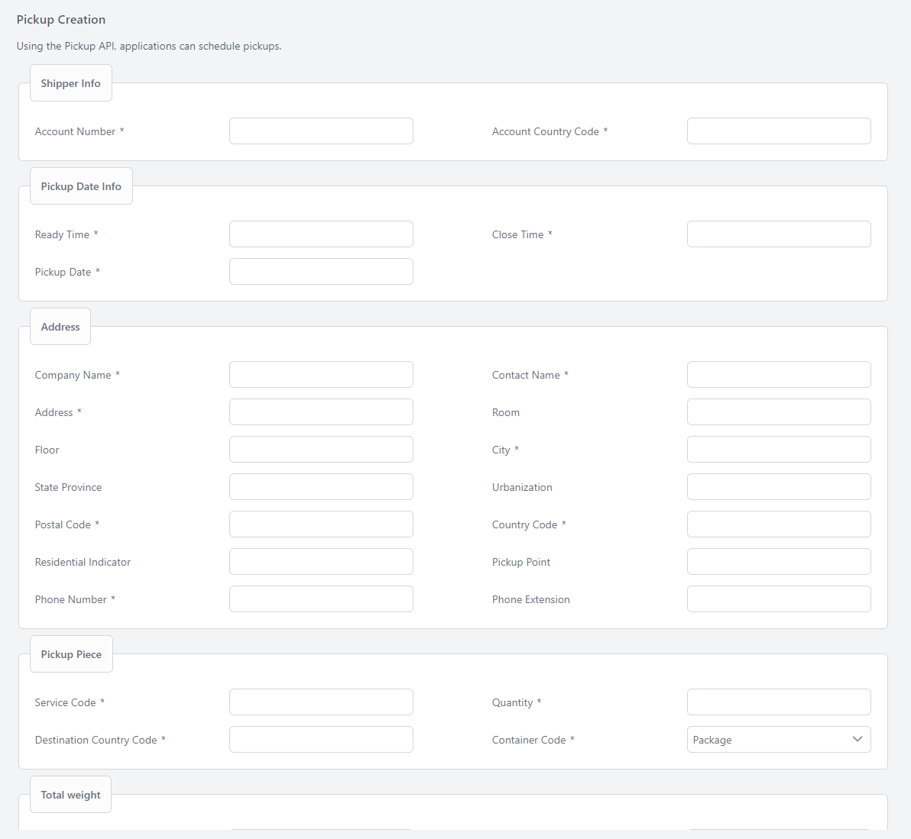

4. Click **Process** button to schedule pickups

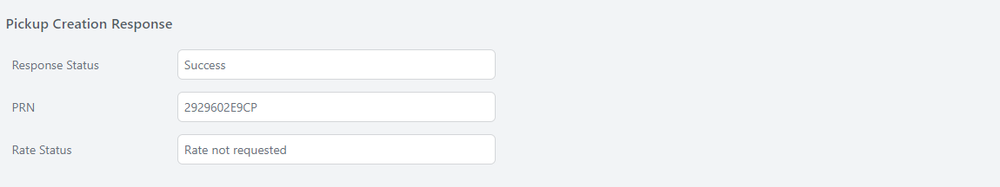

### Pickup cancel
This service is used to cancel previously scheduled pickups.
1. Login to the Axon Ivy Portal
2. On the Process List page, click on **Pickup Creation**

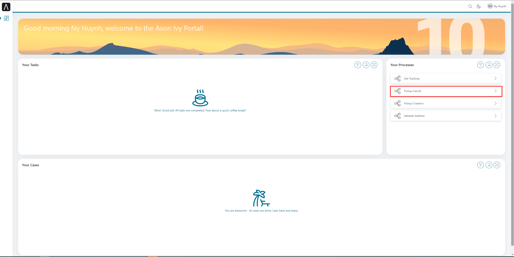

3. Fill in required fields

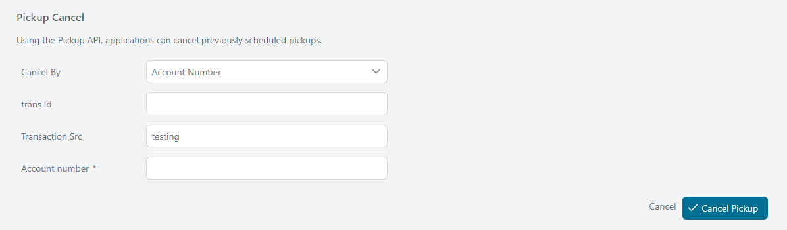

4. Click **Cancel** button to finish

### Address validation
This service is utilized to verify addresses against the United States Postal Service database of valid addresses in the U.S.
1. Login to the Axon Ivy Portal
2. On the Process List page, click on **Validate Address**

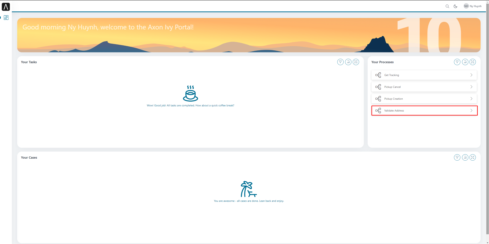

3. Fill in address info

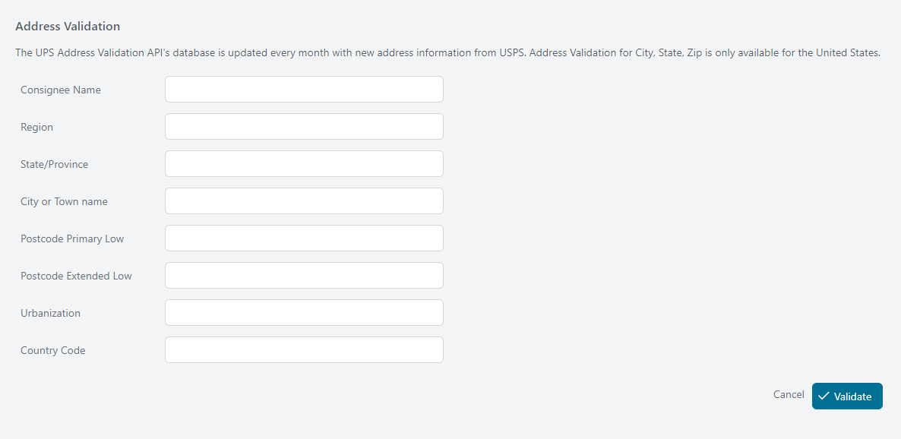

4. Click **Validate** button
